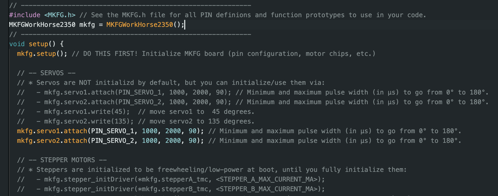

[MKFG](../../../) / [Build](../../) / [Controllers](../)

# MKFG WorkHorse 2350

#### Control Board

 

In trying to create many of the needed automation tools for makeufacturing, it became clear that the "Arduino+shields" approach to making was itself a significant hurdle. Arduino is great as a core set of features to run code on a **modern microcontroller** and quickly plug in a huge range of I2C sensors, but to make a basic system that's also capable of **driving actuators** (DC motors, servos, solenoids, and steppers), handling **12V power** (along with a set of step-down regulators to 5V and 3.3V), and a basic feature complete **user interface for automation** (physical buttons, encoder knob, small screen, RGB status light, and a small speaker) **is still intimidating and highly complex.**

But actually putting these elements together can itself be a feat for many novice makers. High power systems can be difficult and dangerous to make. User interfaces are non-standardized and a design challenge in their own right. And controlling actuators like stepper motors, solenoids, and servos can be complex and error-prone.

After building out a few of these stacks of boards and shields for makeufacturing test systems, it became clear that all of that overhead was a steep hill to climb when **ideally a single board like this would just be a standard component for makeufacturing**. So we made one... not because we want to sell "yet another Arduino board" but instead because it **keeps the focus on actually making the tools that are needed**, not sourcing 5 different boards and spending your time wiring them all together and trying to make them talk to one another.

For many mkfg builds, the **specific core needs include**:

- <b>control</b>: a microcontroller such as an Arduino / Pi Pico / Teensy / ESP32 / etc.
- <b>inputs</b>: a universal I2C port for various plug-n-play sensors via Qwiic/STEMMA QT
- <b>user interface</b>: a common user interface with buttons, push-button knob/encoder, basic screen, multicolor LED, and notification speaker
- <b>automation outputs</b>: medium power actuator control outputs &mdash; upto 2 stepper motors, 2 DC motors/solenoids/vibe, and 2 servos
- <b>power</b>: integrated 12V power handling to safely supply the full range of needed voltages &mdash; 12V motors / 5V servos / 3.3V I2C/GPIO

So we made a simple credit card-sized board, the **MKFG WorkHorse**, that includes all of that together; it's built around **open source hardware, software, and mechanical engineering projects** that allow any curious tinkerers to get their hands dirty and build whatever is needed.

#### Arduino Library

 

#### Case

 

---

### :open_book: Open Source & Creative Commons

**Makeufacturing is fully open source**. It's released under 2 licenses for complete coverage:

* **All source code** (Arduino projects, C code, web code, etc.) is released under **[GNU GPL v3](https://www.gnu.org/licenses/gpl-3.0.en.html)**.

* **Everything else** (documentation, images, videos, write-ups, CAD files, drawings, etc.) is released under **[CC BY-SA 4.0](https://creativecommons.org/licenses/by-sa/4.0/)**.

### :speech_balloon: Questions / Suggestions / Feedback

Have an idea or found a bug? Let us know by **[filing an issue](https://github.com/Makeufacturing/MKFG/issues)** or sharing your **[thoughts/questions](https://github.com/Makeufacturing/MKFG/discussions)** with the community!

### :hand: Safety Disclaimer

> Working with automated equipment, electronics, power tools, hazardous chemicals, and DIY manufacturing systems requires proper precautions. Always wear appropriate safety gear including eye protection, gloves, and respiratory equipment when needed. Consult qualified professionals before working with electrical systems, chemicals, or complex machinery. Keep bystanders clear of operating equipment. Never leave automated systems unattended during operation. Ensure proper ventilation when working with fumes, dust, or chemical vapors. This information is for educational purposes only and does not replace professional safety training or equipment manufacturer instructions. This site and its contributors will not be held liable. **Use at your own risk.**

### :heart: Your support keeps us going :heart:

The Makeufacturing initiative is made possible by **[Makefast](https://makefastworkshop.com)**, a small, family-run prototyping and product development workshop located in Delaware, Ohio. After many attempts at manufacturing our own desktop fabrication products, it became clear how exciting (and technically difficult!) it was to create high quality products at scale out of our home using only DIY/Maker-level tools. We decided to openly catalog and share these learnings in the hopes that other makers around the world may benefit and further grow this **new, highly accessible, industrial revolution**.

If you appreciate this approach and want to see it grow, please consider contributing below. Your financial support allows us to put more time and effort into makeufacturing so that **more people can make more awesome things in more parts of the world**!

**[Support Makeufacturing with a contribution of any amount](https://buy.stripe.com/5kQfZi9WNeac3ba6trcQU02)**

Thanks, and **keep making awesome things!**