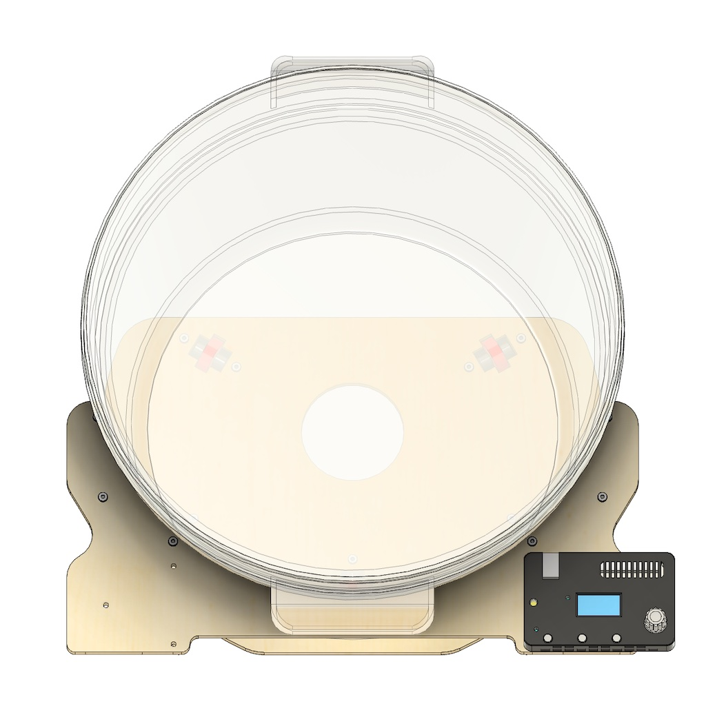
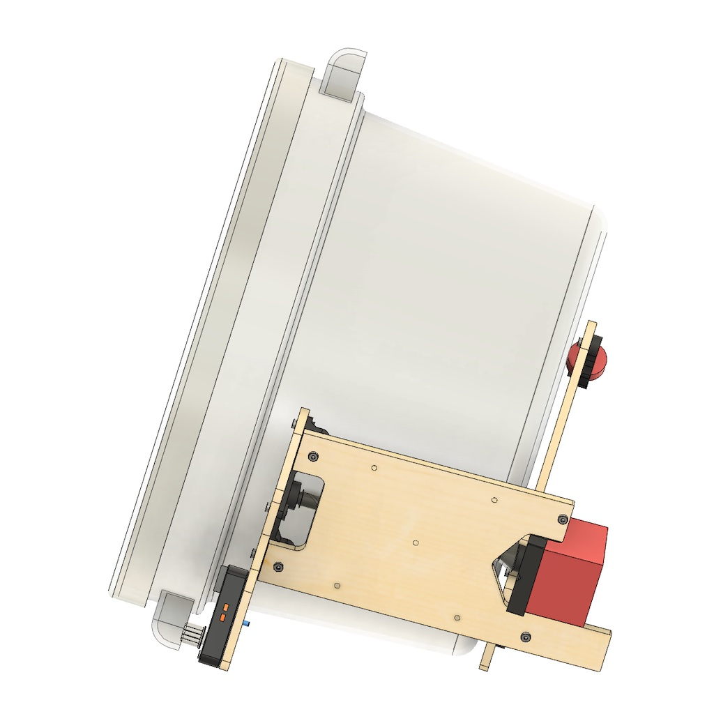

[MKFG](../../../) / [Build](../../) / [Electro-Mechanical Systems](../)

# Gravitational Rotary Kneader

 

Why knead dough like this? A quick refresher on the science...

Bread dough develops in **3 phases**.

**First** wet and dry ingredients need to be mixed together to form a paste. This can be effectively done by hand with batch sizes up to 7kg without requiring machinery.

**Second**, as time passes, the liquid integrates with the flour to hydrate two proteins, gliadin and glutenin. This is achieved by simply letting the dough rest. No machinery needed here either.

And **third**, as these proteins are kneaded and pulled together, they form gluten; an elastic and sticky texture that can trap air bubbles and help bread rise when it bakes. This can be achieved 2 ways:

1. A very strong machine that forces the proteins to mix with **intense mechanical motion over 5-15 minutes**. This is how industrial bread is produced. It's also easy to "overmix" since the dough itself is been pushed to its limit.
2. An **intermittent (every 20-60 minutes) set of low-intensity stretches** that pull the dough against itself a few times, and then let it rest again to relax until the next stretch. This is typically done 2-4 times total, and is traditionally used by artisan bakers worldwide.

Kneading with low-intensity stretches allows the dough to develop more slowly over time. This additional waiting also activates natural enzymes in the flour, like proteases, which makes the resulting bread easier to digest. And by using the dough's own weight as the pulling mechanism, a more relaxed dough will stretch easily, while a tighter dough will not -- greatly reducing the chance of overmixing. In short: **low intensity stretching makes better bread**.

This same stretching approach can be accomplished by slowly rotating the dough in a circular dough tub on its side -- a **gravitational rotary kneader** -- quietly working the dough for us while the next batch is being mixed.

In practice, this seems to work best when using **3-6kg of dough** (so it's heavy enough to stretch itself when turned), in a **12Qt dough tub** (specifically, restaurant grade polypropylene), with **medium to high hydration** (65-90%). Lower hydration doughs are stiffer and take more force to stretch, so the rotation speed should be reduced to compensate. Higher hydration doughs are more slack and can handle a faster rotation speed.

Keep in mind that there are 3 contact surfaces while kneading dough in this way: the bottom of the dough tub, the curved sides, and the top lid. These 3 surfaces provide resistance to the gravitational pull of the dough toward its lowest point while rotating. Operating at a slight angle above horizontal as it turns, over time **the dough fully kneads itself in 3 dimensions** (up/down, left-right, and forward/back).

## Building Instructions

Note: This is a fairly advanced maker-level build. You'll need to work with lasercut wood, printed parts, mechanical hardware, motors, an Arduino-level controller, and some basic code (to program it). Ask for help at your local maker space or library if you're unsure as you. Us makers are in this together and often eager to help out!

   

**To make your own Gravitational Rotary Kneader, you'll need:**

- 1/4" plywood (for laser cutting)
- PETg (or PLA) for all printed parts
- Various M3 and M5 bolts and nuts to connect all of the components.
- 3 x 608 bearings (for rear bearing support)
- 3 x 8mm shafts (for rear bearing support)
- 2 x NEMA 17 stepper motors
- 2 x 5mm shafts (for rollers)
- 2 x MRZ105 bearings (for rollers)
- 2 x silicone tubing (to cover the rollers and provide grip to the outside of the dough tub)
- 1 x MKFG control board (or Arduino + stepper motor control shield)
- 1 x 12Qt polypropylene dough tub w/ lid for testing

#### Known issues (future things to fix):

* Sides should be extended to reduce the chance of tilting backward when no dough tub is present.
* Mounting holes for control board should align with the MKFG WorkHorse case holes for simple attachment.
* Fitting the silicone onto the rollers is a bit challenging. Look for a way to improve this part of the assembly process.
* Lots of nuts and bolts; aim to reduce overall part count where possible.
* Need to include a simple Arduino+stepper shield example that runs the default speed curve on power-on.

## CAD Reference

    

The full <a href="./CAD/">Gravitational Rotary Kneader CAD files</a> are included for reference.

---

### :open_book: Open Source & Creative Commons

**Makeufacturing is fully open source**. It's released under 2 licenses for complete coverage:

* **All source code** (Arduino projects, C code, web code, etc.) is released under **[GNU GPL v3](https://www.gnu.org/licenses/gpl-3.0.en.html)**.

* **Everything else** (documentation, images, videos, write-ups, CAD files, drawings, etc.) is released under **[CC BY-SA 4.0](https://creativecommons.org/licenses/by-sa/4.0/)**.

### :speech_balloon: Questions / Suggestions / Feedback

Have an idea or found a bug? Let us know by **[filing an issue](https://github.com/Makeufacturing/MKFG/issues)** or sharing your **[thoughts/questions](https://github.com/Makeufacturing/MKFG/discussions)** with the community!

### :hand: Safety Disclaimer

> Working with automated equipment, electronics, power tools, hazardous chemicals, and DIY manufacturing systems requires proper precautions. Always wear appropriate safety gear including eye protection, gloves, and respiratory equipment when needed. Consult qualified professionals before working with electrical systems, chemicals, or complex machinery. Keep bystanders clear of operating equipment. Never leave automated systems unattended during operation. Ensure proper ventilation when working with fumes, dust, or chemical vapors. This information is for educational purposes only and does not replace professional safety training or equipment manufacturer instructions. This site and its contributors will not be held liable. **Use at your own risk.**

### :heart: Your support keeps us going :heart:

The Makeufacturing initiative is made possible by **[Makefast](https://makefastworkshop.com)**, a small, family-run prototyping and product development workshop located in Delaware, Ohio. After many attempts at manufacturing our own desktop fabrication products, it became clear how exciting (and technically difficult!) it was to create high quality products at scale out of our home using only DIY/Maker-level tools. We decided to openly catalog and share these learnings in the hopes that other makers around the world may benefit and further grow this **new, highly accessible, industrial revolution**.

If you appreciate this approach and want to see it grow, please consider contributing below. Your financial support allows us to put more time and effort into makeufacturing so that **more people can make more awesome things in more parts of the world**!

**[Support Makeufacturing with a contribution of any amount](https://buy.stripe.com/5kQfZi9WNeac3ba6trcQU02)**

Thanks, and **keep making awesome things!**