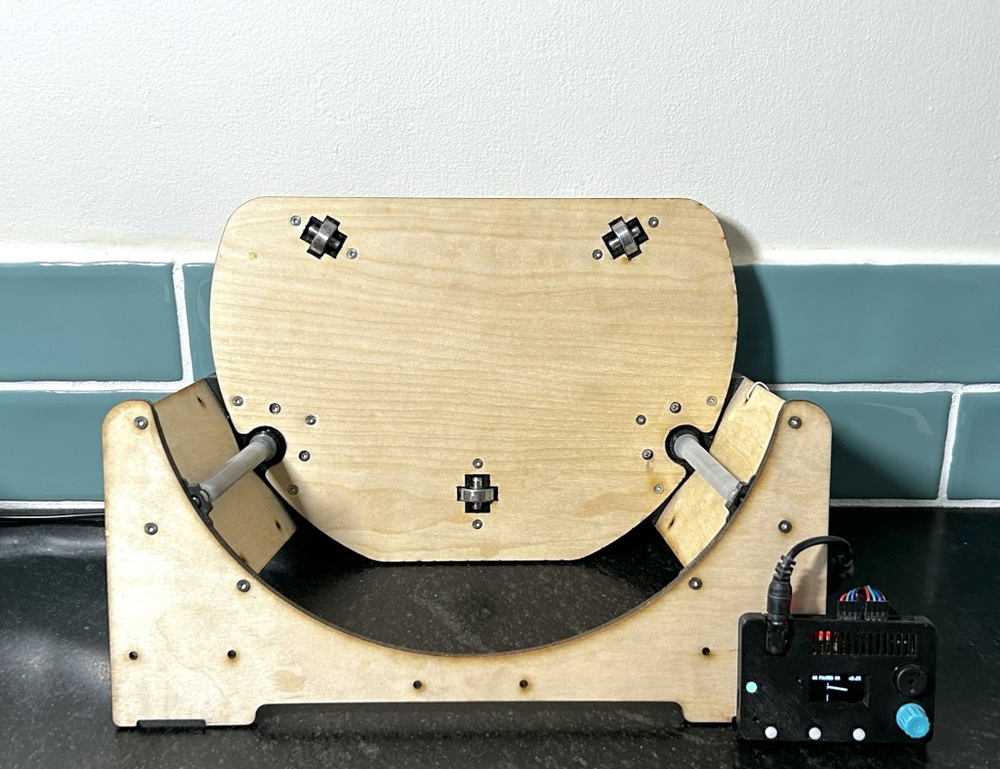
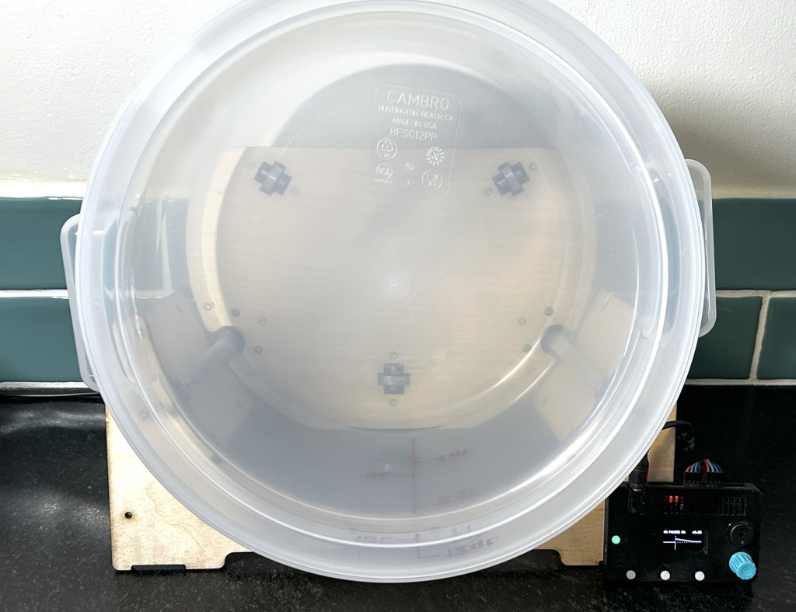

[MKFG](../../) / [Build](../)

# Electro-Mechanical Systems (MKFG Robotics)

Specialized makeufacturing systems that combine sensing, control, and actuation to help in performing semi-automated tasks.

:exclamation: **This is a massive work-in-progress!** If you have relevant open source projects to add to this list, please let us know by sharing your **[thoughts](https://github.com/Makeufacturing/MKFG/discussions)** with the MKFG community.​ Thanks!

Makeufacturing encourages breaking down complex automated tasks into smaller dedicated subsystems (i.e. segments) that can be tested, re-arranged, and joined together as production needs evolve. Depending on what you're production line's <u>subject</u> is (solid, liquid, or gas), various segments have been created for a wide range of applications. 

Your specific makeufacturing system may require some alterations, so don't hesitate to post questions or suggestions if you run into roadblocks or need help getting started.

## Solids

### Mixers 

*tumbler, paddle/beater/stir, shaker, rotary, etc.*

*    
  **<a href="./GravitationalRotaryKneader/">Gravitational Rotary Kneader</a>**: A low-speed dough kneading machine that rotates a round dough tub over an extended period of time to build gluten structure using the dough's own weight to continually stretch and fold it upon itself.

### Bulk Feeders 

*control output of a bulk set of items down to N-at-a-time; apron, auger/screw, disc, vibratory bowl/trough, reciprocating, etc.*

* [Vibratory Bowl Feeder MKII](https://www.thingiverse.com/thing:2119002) by [VikingNZ](https://www.thingiverse.com/VikingNZ) (uses 385 DC motor w/ eccentric weight)
* [Vibratory Bowl Feeder MK3](https://www.thingiverse.com/thing:4057174) by [Jordie_796](https://www.thingiverse.com/Jordie_796) (uses 385 DC motor)
* [Vibratory Trough Feeder](https://www.thingiverse.com/thing:2118961) by [VikingNZ](https://www.thingiverse.com/VikingNZ) (uses 385 DC motor w/ eccentric weight)
* [Auger/Screw Feeder](https://www.thingiverse.com/thing:958180) by [NorthernLayers](https://www.thingiverse.com/NorthernLayers) (uses NEMA17 stepper motor)
* [Auger/Screw Feeder](https://www.thingiverse.com/thing:4753380) by [PavelNS](https://www.thingiverse.com/PavelNS) (uses NEMA17 stepper motor)

### Powder Feeders

*dispensing powders like flour, salt, etc. for baking, or industrial mixes like concrete, sand, etc.*

### Linear/Rotary Transfer Devices 

*control movement of a set of N items; belt/chain/bucket/mag conveyor, walking beam, powered roller, rotary transfer, etc.*

### Spool Dispensers

*fabric, sheet metal, string, wire, paper, tape, ribbon, etc. + cut to length*

* [Wire Stripper/Cutter](https://www.thingiverse.com/thing:5599845) by [electricdiylab](https://www.thingiverse.com/electricdiylab) (2 x NEMA17 stepper + servo + wire cutters)

### Flow Controllers

*pushers, branchers/forkers, etc.*

### Presses/Stampers

*Mold forming, marking, fitting, compressing, etc.*

### Heaters/coolers

*air heaters/coolers, radiant heaters, conduction/peltier heaters/coolers, high-temp/stovetop, etc.*

### Encasers/Wrappers

*wire wrapping, pre-packaging, sealing, etc.*

* [Wire Wrapper](https://electricdiylab.com/diy-arduino-based-wire-harness-wrapping-machine/) by  [sandeep](https://electricdiylab.com/author/howtocircuitadmin/)

### Labelers

*cylindrical/rolling, box/flat*

### Aligners

*orient, flip, rotate, etc.*

### Packagers

*controlled dispensing into bulk container, box, bag, etc. + closure*

### Analyzers 

*color, position, orientation, weight, presence, count, imaging, barcode, etc.*

### Complex Operators

Some segments may be significantly more complicated stand-alone devices that fall outside the scope of makeufactoring's core abilities. These primarily fall into two major categories:

1. **Robotic arms** for assembly, handling, and machining (highly complicated, expensive, and dangerous)
2. **Stand-alone external operators** (feed subject in/out of existing off-the-shelf complex/powerful machines via makeufacturing segments: 3D printer, laser cutter, cnc mill/drill/router, pick/place, sewing machine, injection molding, etc.)

## Liquids

### Pumps 

*paristaltic, diaphragm, gravity, etc.*

* Reference: [paristaltic w/ variable size tubing/flowrate](https://www.amazon.com/Peristaltic-Pump-24V-motor-2200mL/dp/B06XF6KK3T)

### Flow Controllers

*valves, restrictors, channel selectors, etc.*

### Heaters/coolers

*resistive, radiant, heat pump, etc.*

### Stirrers 

*mag, whisk, etc.*

### Packagers 

*controlled amount of liquid into bulk container, bottles, cans, etc. + closure*

### Analyzers 

*pH, color, disolved solids, weight, flowrate, volume, etc.*

## Gases

### Pumps

*vacuums, compressors, etc.*

### Flow Controllers

*valves, restrictors, channel selectors, etc.*

### Heaters/coolers

### Fillers

*controlled amount of gas into bulk container, bottle, etc. + closure*

### Analyzers

*pressure, color, moisture, VOCs, flowrate, etc.*

---

### :open_book: Open Source & Creative Commons

**Makeufacturing is fully open source**. It's released under 2 licenses for complete coverage:

* **All source code** (Arduino projects, C code, web code, etc.) is released under **[GNU GPL v3](https://www.gnu.org/licenses/gpl-3.0.en.html)**.

* **Everything else** (documentation, images, videos, write-ups, CAD files, drawings, etc.) is released under **[CC BY-SA 4.0](https://creativecommons.org/licenses/by-sa/4.0/)**.

### :speech_balloon: Questions / Suggestions / Feedback

Have an idea or found a bug? Let us know by **[filing an issue](https://github.com/Makeufacturing/MKFG/issues)** or sharing your **[thoughts/questions](https://github.com/Makeufacturing/MKFG/discussions)** with the community!

### :hand: Safety Disclaimer

> Working with automated equipment, electronics, power tools, hazardous chemicals, and DIY manufacturing systems requires proper precautions. Always wear appropriate safety gear including eye protection, gloves, and respiratory equipment when needed. Consult qualified professionals before working with electrical systems, chemicals, or complex machinery. Keep bystanders clear of operating equipment. Never leave automated systems unattended during operation. Ensure proper ventilation when working with fumes, dust, or chemical vapors. This information is for educational purposes only and does not replace professional safety training or equipment manufacturer instructions. This site and its contributors will not be held liable. **Use at your own risk.**

### :heart: Your support keeps us going :heart:

The Makeufacturing initiative is made possible by **[Makefast](https://makefastworkshop.com)**, a small, family-run prototyping and product development workshop located in Delaware, Ohio. After many attempts at manufacturing our own desktop fabrication products, it became clear how exciting (and technically difficult!) it was to create high quality products at scale out of our home using only DIY/Maker-level tools. We decided to openly catalog and share these learnings in the hopes that other makers around the world may benefit and further grow this **new, highly accessible, industrial revolution**.

If you appreciate this approach and want to see it grow, please consider contributing below. Your financial support allows us to put more time and effort into makeufacturing so that **more people can make more awesome things in more parts of the world**!

**[Support Makeufacturing with a contribution of any amount](https://buy.stripe.com/5kQfZi9WNeac3ba6trcQU02)**

Thanks, and **keep making awesome things!**