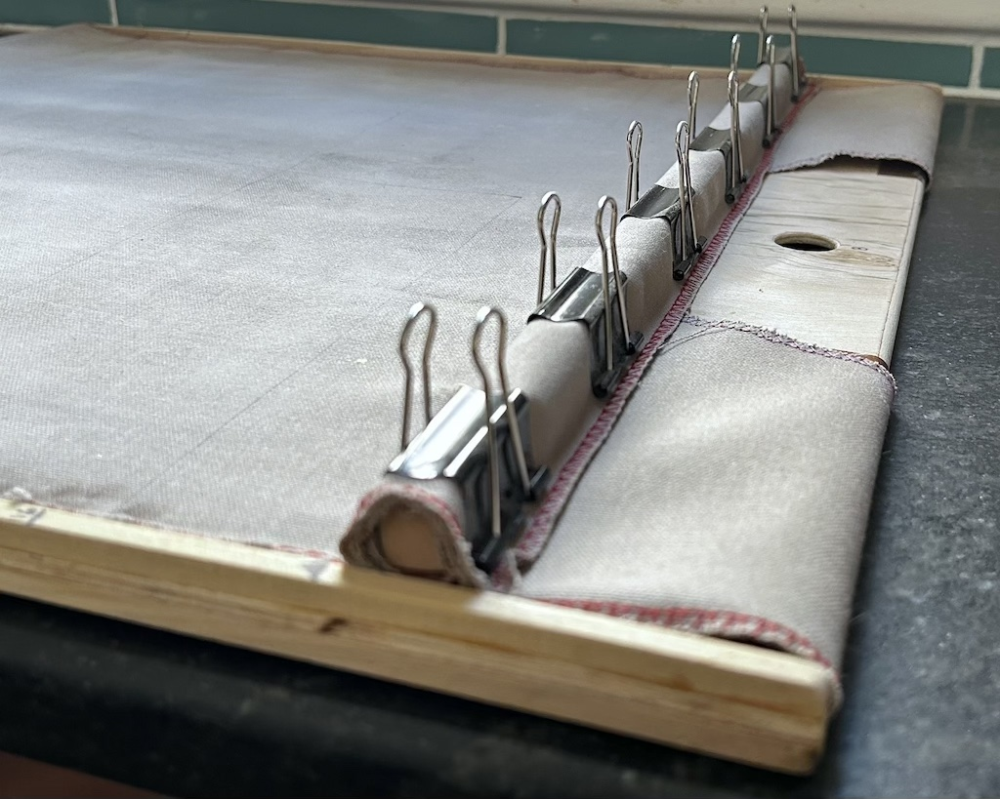
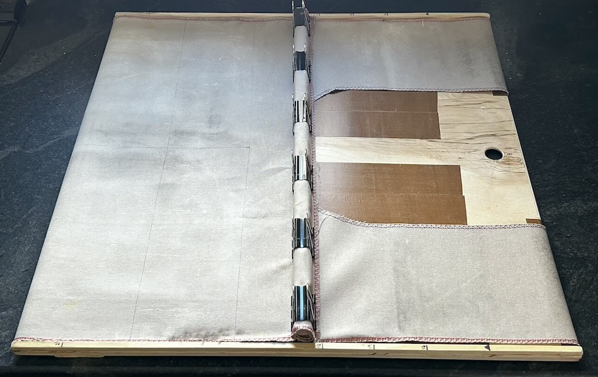
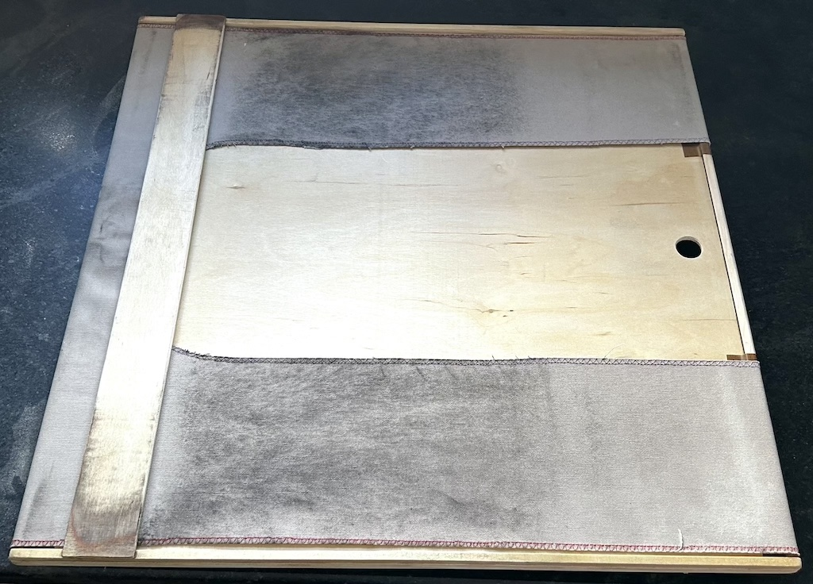

[MKFG](../../../) / [Build](../../) / [Mechanical Aids](../)

# DIY Dough Loader

  

If you've ever watched a professional baker load dough into a hot oven, you've probably seen a "dough loader." These fairly basic conveyor gadgets are a big help when handling delicate dough and getting it into the oven without deforming or degassing it.

For home bakers, most people transfer dough to the oven either via parchment paper (since it can easily slide around) or with a baker's peel (think pizza making). But when it comes to baking bread, parchment can affect the bottom crust (in addition to feeling a bit wasteful), and using a peel requires quick motions that can deflate the dough if anything sticks (often leading to over-flouring the bottom or relying on cornmeal/semolina to prevent sticking).

There are a few other solutions [[1](http://www.thefreshloaf.com/node/51803/loading-peel-domestic-oven),[2](https://www.amazon.com/EXO-Non-Stick-Polymer-Sealed-Super/dp/B00NGOOM6K),[3](https://www.panimatic.com/OPTICOUCHE_821_76_1232.html),[4](https://www.instructables.com/DIY-Dough-Loader/)] out there, but this one is simple, highly functional, and uses things you probably already have around the house (plus maybe a quick trip to your local hardware store for the wood).

 

## Building Instructions

**To make your own DIY Dough Loader, you'll need:**

- 1 x 3/16" to 1/4" thick plywood sheet (as big as you want your loader to be).
- 4 x 1/4" square dowel rods (these form the top and bottom guide edges).
- 3 x 1/8" plywood sheet (these act as a spaces to keep the belt off of the deck and round the edges).
- 1 x 1/2" square wooden dowel (the handle that the conveyor cloth gets wrapped around).
- 1 x piece of cotton duck canvas fabric to use as the conveyor belt.
- 5 x medium binder clips (to hold everything in place)
- Some wood glue, small clamps, and sewing machine if you want to finish the edges of the conveyor after it has been cut to size.

 

**Then roughly follow this process:**

* Cut the 1/4" plywood sheet such that it fits your oven with about 1" of clearance on the sides and 6" extra on the front (so you have a place to hold it while it's in the oven). For a standard American-sized oven, that should be about **22"x22"**.

* Cut four 1/4" square wood dowels to match the length of the loader sheet (22").

*   
  Glue and clamp the 1/4" square dowels to the sides on the top and bottom of the sheet as shown.

* Optionally, you can also add an extra 1/8" strip underneath the ends to increase the radius that the conveyor will travel around (this reduces the pulling force needed). 

*  
  Sand to round all corners and remove any splinters. 

*  
  Next, cut the cotton duck cloth conveyor fabric to be just slightly narrower than the sheet (inside the rails, ~21.5" wide) and about 2.25x as long (~50" long). Then mark an elongated hole so that you'll be able to hold the sheet while the conveyor slides once it's assembled. Once cut, you can finish the edges of the conveyor with a sewing machine to limit the chances of any frayed cotton fabric ending up in the oven as well.

*  
  Drill a thumb-sized hole in the end you plan to hold when loading the dough. You can also reduce friction (so that it's easier to load larger batches of dough without the conveyor binding up) by applying PTFE tape underneath the conveyor on the top side and around the ends.

*    

  Now put it everything together. Feed the conveyor around the sheet between the wooden rails, loop it back around the 1/2" square wooden dowel, and tightly secure with binder clips as shown. It should slide easily back and forth with only a small amount of slack.

*   
  It's also advisable to add a deck guard that runs underneath the bottom of the conveyor such that it won't get pinched if the dough loader isn't perfectly aligned with your deck and scoots to the side.

* You can also draw lines on the canvas with a food-safe fine-tip permanent marker as a reference to make placing dough easier. A center line and some length indicators can be a big help.

Congrats. You're **all set and ready to load some dough.** 

 

**Happy baking!**

## CAD Reference

From the pictures and descriptions alone you can probably figure it out and easily adjust the sizing to your specific oven setup, but the full <a href="./CAD/">CAD files</a> are included if you want to get super detailed about it.

 

---

### :open_book: Open Source & Creative Commons

**Makeufacturing is fully open source**. It's released under 2 licenses for complete coverage:

* **All source code** (Arduino projects, C code, web code, etc.) is released under **[GNU GPL v3](https://www.gnu.org/licenses/gpl-3.0.en.html)**.

* **Everything else** (documentation, images, videos, write-ups, CAD files, drawings, etc.) is released under **[CC BY-SA 4.0](https://creativecommons.org/licenses/by-sa/4.0/)**.

### :speech_balloon: Questions / Suggestions / Feedback

Have an idea or found a bug? Let us know by **[filing an issue](https://github.com/Makeufacturing/MKFG/issues)** or sharing your **[thoughts/questions](https://github.com/Makeufacturing/MKFG/discussions)** with the community!

### :hand: Safety Disclaimer

> Working with automated equipment, electronics, power tools, hazardous chemicals, and DIY manufacturing systems requires proper precautions. Always wear appropriate safety gear including eye protection, gloves, and respiratory equipment when needed. Consult qualified professionals before working with electrical systems, chemicals, or complex machinery. Keep bystanders clear of operating equipment. Never leave automated systems unattended during operation. Ensure proper ventilation when working with fumes, dust, or chemical vapors. This information is for educational purposes only and does not replace professional safety training or equipment manufacturer instructions. This site and its contributors will not be held liable. **Use at your own risk.**

### :heart: Your support keeps us going :heart:

The Makeufacturing initiative is made possible by **[Makefast](https://makefastworkshop.com)**, a small, family-run prototyping and product development workshop located in Delaware, Ohio. After many attempts at manufacturing our own desktop fabrication products, it became clear how exciting (and technically difficult!) it was to create high quality products at scale out of our home using only DIY/Maker-level tools. We decided to openly catalog and share these learnings in the hopes that other makers around the world may benefit and further grow this **new, highly accessible, industrial revolution**.

If you appreciate this approach and want to see it grow, please consider contributing below. Your financial support allows us to put more time and effort into makeufacturing so that **more people can make more awesome things in more parts of the world**!

**[Support Makeufacturing with a contribution of any amount](https://buy.stripe.com/5kQfZi9WNeac3ba6trcQU02)**

Thanks, and **keep making awesome things!**