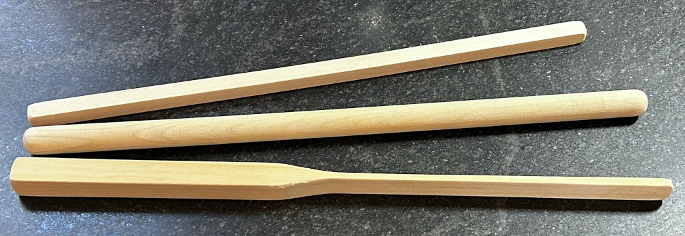
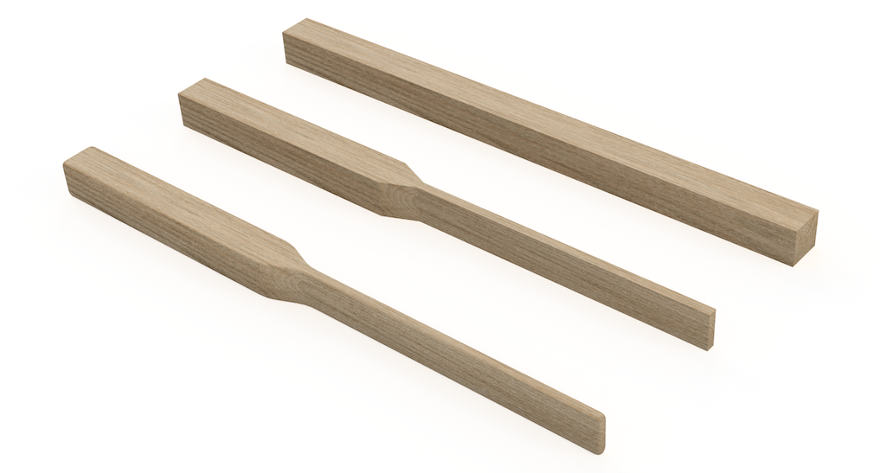

[MKFG](../../../) / [Build](../../) / [Mechanical Aids](../)

# Dough Mixing Sticks

  

You can mix dough with any food-safe implement you like (including your hands!), but as you scale up your batch sizes, using a purpose-built tool can make the work a lot easier.

A good mixing stick should feel **comfortable and sturdy in the hand** while also effectively working the dough as it comes together. We've found that a **0.75 - 1.25 inch diameter wooden dowel** is the sweet spot. Much thinner, and it risks breaking. Much thicker and it's hard to hold and push through stiffer doughs.

We also like having a **flattened end** such that it can be turned to give more/less resistance in the dough. It also enables you to **use it as a wedge to lift the dough off the bottom of the dough tub** while mixing with minimal effort. And flat sides make it easier to scrape down and clean.

In less than 10 minutes of sawing and sanding, you can make your own optimized mixing stick for just a few dollars.

## Building Instructions

**To make your own Dough Mixing Stick, you'll need:**

- **0.75 to 1.25 inch square wooden dowel**, at least **16 inches long**. Food-safe hardwoods like maple, oak, cherry, walnut, or beech wood are particularly good if you can find them, but pine or poplar will work in a pinch. Even the nicer hardwoods at this size are around $8 for a dowel that's long enough to make 2 sticks, so go for the good stuff if you can.
- You'll also need a saw (hand saw, or bandsaw if you have access to one) and some sandpaper.

 

**Then roughly follow this process:**

* Cut the square dowel down to around 16" long.

* Mark a center line and draw a 1/4" wide section, approximately 8" long. Taper the thin section so it gradually gets wider over and inch or so near the middle of the stick.

* Using proper safety equipment and great care, cut the wood on the lines you made.

* Sand down all rough corners.

* Wash and dry your mixing stick so it's ready for use!

## CAD Reference

There's also a dimensioned <a href="./MKFG_DoughMixingStick Drawing.pdf">CAD drawing</a> you can reference if you find it helpful.

---

### :open_book: Open Source & Creative Commons

**Makeufacturing is fully open source**. It's released under 2 licenses for complete coverage:

* **All source code** (Arduino projects, C code, web code, etc.) is released under **[GNU GPL v3](https://www.gnu.org/licenses/gpl-3.0.en.html)**.

* **Everything else** (documentation, images, videos, write-ups, CAD files, drawings, etc.) is released under **[CC BY-SA 4.0](https://creativecommons.org/licenses/by-sa/4.0/)**.

### :speech_balloon: Questions / Suggestions / Feedback

Have an idea or found a bug? Let us know by **[filing an issue](https://github.com/Makeufacturing/MKFG/issues)** or sharing your **[thoughts/questions](https://github.com/Makeufacturing/MKFG/discussions)** with the community!

### :hand: Safety Disclaimer

> Working with automated equipment, electronics, power tools, hazardous chemicals, and DIY manufacturing systems requires proper precautions. Always wear appropriate safety gear including eye protection, gloves, and respiratory equipment when needed. Consult qualified professionals before working with electrical systems, chemicals, or complex machinery. Keep bystanders clear of operating equipment. Never leave automated systems unattended during operation. Ensure proper ventilation when working with fumes, dust, or chemical vapors. This information is for educational purposes only and does not replace professional safety training or equipment manufacturer instructions. This site and its contributors will not be held liable. **Use at your own risk.**

### :heart: Your support keeps us going :heart:

The Makeufacturing initiative is made possible by **[Makefast](https://makefastworkshop.com)**, a small, family-run prototyping and product development workshop located in Delaware, Ohio. After many attempts at manufacturing our own desktop fabrication products, it became clear how exciting (and technically difficult!) it was to create high quality products at scale out of our home using only DIY/Maker-level tools. We decided to openly catalog and share these learnings in the hopes that other makers around the world may benefit and further grow this **new, highly accessible, industrial revolution**.

If you appreciate this approach and want to see it grow, please consider contributing below. Your financial support allows us to put more time and effort into makeufacturing so that **more people can make more awesome things in more parts of the world**!

**[Support Makeufacturing with a contribution of any amount](https://buy.stripe.com/5kQfZi9WNeac3ba6trcQU02)**

Thanks, and **keep making awesome things!**