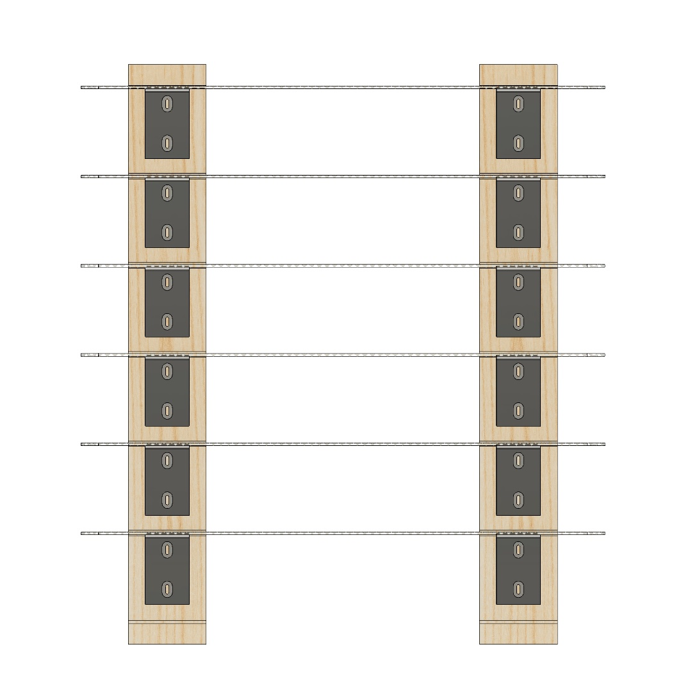
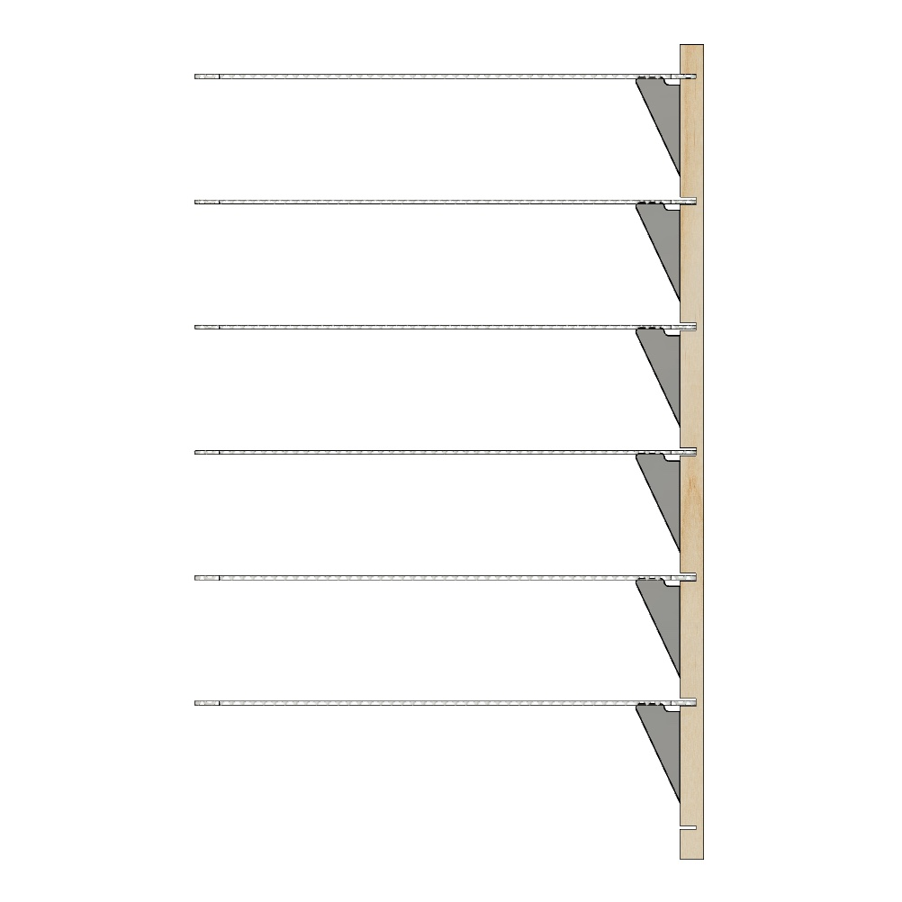

[MKFG](../../../) / [Build](../../) / [Mechanical Aids](../)

# Modular Cooling Racks

  

**A modular, wall-mounted cooling rack system allows for placing racks only when needed while also keeping the floor and counter space clear**. 

## Building Instructions

**To make your own Modular Cooling Racks, you'll need:**

- 2 x 1x4 boards, around 26" long.
- 1 x 3D printed drill jig.
- 12 x 3D printed RackBraces (or less if you don't need as many cooling racks).
- 24 x #8x3/4" long Truss Head screws (wide head with flat underside).
- 3+ Full Sheet Pan (16x24") wire mesh cooling racks (like [this](https://www.webstaurantstore.com/choice-16-7-16-x-24-1-2-chrome-plated-footed-wire-cooling-rack-pan-grate-for-full-size-sheet-pan/407CRKFULLCH.html) or [this](https://www.amazon.com/dp/B085P1764K)).

**Then roughly follow this process:**

* Cut 1x4 boards to length (~26")
* Cut 1/4" wide slots into 1x4 at specific locations. Boards can be cut at the same time to ensure that slots are well aligned (make sure to that they are sufficiently clamped).
* Drill 1/4" mounting holes.
* Use drill guide to make small 7/64" holes below each slot (as shown).  
* Place printed RackBraces and screw loosely into place with #8x3/4" Truss Head screws.
* Place each rack and adjust height of RackBrace until rack is level. Tighten screws into place.

  

 

## CAD Reference

See the dimensioned <a href="./Fab_ToCutWood/MKFG_ModularWallRack_drawing.pdf">drawing</a> for where to cut the 1x4 rails.

The full [Modular Rack CAD](./CAD/) is also available.

   

---

### :open_book: Open Source & Creative Commons

**Makeufacturing is fully open source**. It's released under 2 licenses for complete coverage:

* **All source code** (Arduino projects, C code, web code, etc.) is released under **[GNU GPL v3](https://www.gnu.org/licenses/gpl-3.0.en.html)**.

* **Everything else** (documentation, images, videos, write-ups, CAD files, drawings, etc.) is released under **[CC BY-SA 4.0](https://creativecommons.org/licenses/by-sa/4.0/)**.

### :speech_balloon: Questions / Suggestions / Feedback

Have an idea or found a bug? Let us know by **[filing an issue](https://github.com/Makeufacturing/MKFG/issues)** or sharing your **[thoughts/questions](https://github.com/Makeufacturing/MKFG/discussions)** with the community!

### :hand: Safety Disclaimer

> Working with automated equipment, electronics, power tools, hazardous chemicals, and DIY manufacturing systems requires proper precautions. Always wear appropriate safety gear including eye protection, gloves, and respiratory equipment when needed. Consult qualified professionals before working with electrical systems, chemicals, or complex machinery. Keep bystanders clear of operating equipment. Never leave automated systems unattended during operation. Ensure proper ventilation when working with fumes, dust, or chemical vapors. This information is for educational purposes only and does not replace professional safety training or equipment manufacturer instructions. This site and its contributors will not be held liable. **Use at your own risk.**

### :heart: Your support keeps us going :heart:

The Makeufacturing initiative is made possible by **[Makefast](https://makefastworkshop.com)**, a small, family-run prototyping and product development workshop located in Delaware, Ohio. After many attempts at manufacturing our own desktop fabrication products, it became clear how exciting (and technically difficult!) it was to create high quality products at scale out of our home using only DIY/Maker-level tools. We decided to openly catalog and share these learnings in the hopes that other makers around the world may benefit and further grow this **new, highly accessible, industrial revolution**.

If you appreciate this approach and want to see it grow, please consider contributing below. Your financial support allows us to put more time and effort into makeufacturing so that **more people can make more awesome things in more parts of the world**!

**[Support Makeufacturing with a contribution of any amount](https://buy.stripe.com/5kQfZi9WNeac3ba6trcQU02)**

Thanks, and **keep making awesome things!**