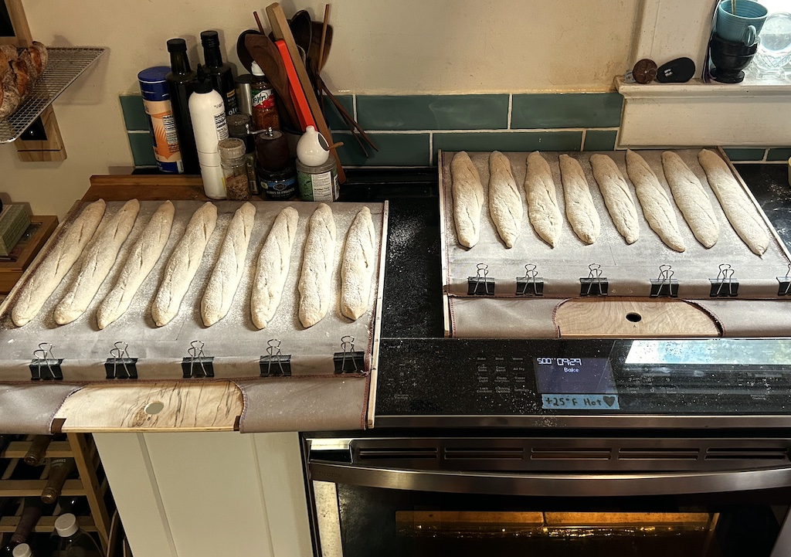
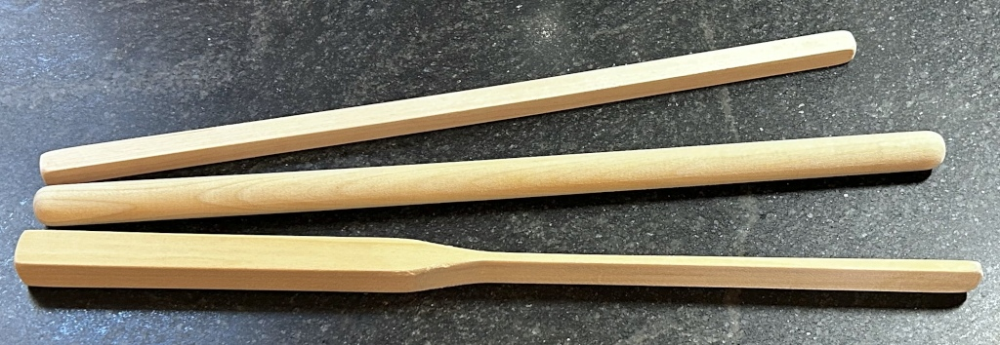
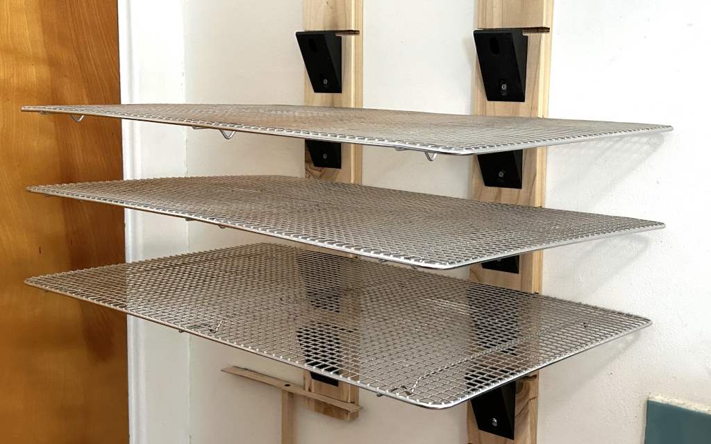

[MKFG](../../) / [Build](../)

# Mechanical Aids (Tools, Linkages, and Guides)

The right tool can make all the difference. Even if it's just a simple stick of wood or organization caddy to make your process more efficient and easier to perform. 

Use these tools to help improve your makeufacturing efforts, **organized by usage/domain:**

## Baking

*  
  **<a href="./DoughLoader/">Dough Loader</a>**: DIY conveyor dough loader, designed for home oven use in artisan baking.
*  
  **<a href="./DoughMixingSticks/">Dough Mixing Sticks</a>**: Simple tool for efficiently mixing unto 7kg of dough at a time by hand.
*  **<a href="ModularCoolingRacks">Modular Cooling Racks</a>**: Wall-mounted rack system that allows for multiple full size cooling racks when need, while keeping kitchen space open on non-baking days.

## MKFG Mechanics Best Practices

### Interconnect

Makeufacturing is an international effort; segments should use metric fasteners where they connect to each other.

**Components should connect with M3 or M5 bolts/nuts and spaced on a 2cm grid when possible.** Specific connection patterns are still evolving.

- **M3 bolts** should be used when attaching plastic/printed parts to one another (for strongest connections in printed parts, consider hex/square nut pockets; only use [M3 heat-set inserts](https://www.mcmaster.com/#catalog/94180A333) if truly needed).
- **M5 bolts** should be used when connecting to support structures (such as 80/20 rail) or joining high-load elements.
- For **wood/sheet metal screws**, M3/M5 equivalents can be hard to find in some regions but can be substituted with #4/#10 gauge sizes in most cases.
- M5 bolts can be directly used in wood (for medium/low stress parts that need tight cylindrical fitting on mating components); use 4.2mm drill in hard woods (or 4.0mm for soft woods).

### Structure

**Use 20mm 80/20-style frame construction to support and position components.** 20mm aluminum extrusion is small, quite strong, and rather inexpensive. The slot on each side allows for attaching pieces with threaded inserts via M5 bolts. There are also double wide beams available when needed for additional strength or support.

Note that many smaller mkfg segments may not require any explicit structure (for example, if it is primarly a printed part), but a structural "rail" may still be helpful to align and secure multiple segments to one another.

#### *Suggested Parts*

In addition to [standard 80/20 parts](https://www.8020.net/) and the selection on [McMaster-Carr](https://www.mcmaster.com/#80-20-compatible-t-slotted-framing/=0d757f6b098f4c5fbe4f89502cc26bd3jg5dnb3m), Misumi offers [80/20 compatible alternatives](https://us.misumi-ec.com/vona2/mech/M1500000000/M1501000000/M1501010000/) that can be 20-50% less expensive:

- [HFS5-2020-1000](https://us.misumi-ec.com/vona2/detail/110302683830/?ProductCode=HFS5-2020-1000): 20mm square - $5.70/meter
- [HFS5-2040-1000](https://us.misumi-ec.com/vona2/detail/110302684350/?ProductCode=HFS5-2040-1000): Double wide (20x40mm) for increased strength/stability - $10.80/meter
- [HBKTST5](https://us.misumi-ec.com/vona2/detail/110302060920/?ProductCode=HBKTST5): 90 degree bracket with perpendicular M5 hole for mounting feet - $1.38 (need screws/nuts)
- [HBLFSNF5-C](https://us.misumi-ec.com/vona2/detail/110300437260/?ProductCode=HBLFSNF5-C): 90 degree corner (also includes perpendicular M5 hole) - $0.63 (need screws/nuts).
- [HNTP5-5](https://us.misumi-ec.com/vona2/detail/110302247640/?ProductCode=HNTP5-5): Drop-in nuts with spring ball - $0.58
- [HNKK5-5](https://us.misumi-ec.com/vona2/detail/110302246940/?ProductCode=HNKK5-5): Economy slide-in nuts - $0.20/each (need screws)

There are also many existing printable addons, supports, brackets, etc. for 2020-based construction systems:

- 2020 Printable M3 bolt/nut adapter - [1](https://www.thingiverse.com/thing:3050607)
- 2020 90 degree brackets - [1](https://www.thingiverse.com/thing:2825139) [2](https://www.thingiverse.com/thing:2771055)
- 2020 Cable clips - [1](https://www.thingiverse.com/thing:2783284) [2](https://www.thingiverse.com/thing:2783302)
- 2020 NEMA17 stepper motor mounts - [1](https://www.thingiverse.com/thing:1612992)
- 2020 example systems
  - [Linear rail segment](https://www.thingiverse.com/thing:2136372)
  - [Carraige stepper driver segment](https://www.thingiverse.com/thing:1361786)

### Misc Hardware

To round out some of the other common mechanical hardware used for automated systems that easily integreate with M3/M5 fasteners and 80/20-style frame construction, here are some parts to leverage where appropriate.

* **625x Ball Bearing** (625Z, 625ZZ, 625-2S, etc.): 5mm diameter center hole (fits M5 bolt or dedicated 5mm machine pin/dowel),16mm O.D., 5mm thick. Note that this is same bearing often used in NEMA 17 stepper motors.
* **608x Ball Bearing**: 8mm diameter center hole. Due to their use in skateboards and fidget spinners, these are some of the most inexpensive, reliable, and widely available bearings.

### Secondary Filler/Scrap

Some mkfg segments may require various pieces of material to hold, span, or otherwise support components without needing tight tolerances or particular mechanical attributes. These "filler" materials should be inexpensive and accessible, using only basic hand tools to cut and form them. 

Filler materials may include things like plywood, sand, repurposed bottles and containers, cardboard from packaging, fabric scraps, etc. to assist with non-critical parts of a design. For example, a long conveyor belt segment may use a few pieces of scrap wood to support the belt's surface (instead of 3D printing multiple large plastic slabs), thus reducing the overall cost and build time.

---

### :open_book: Open Source & Creative Commons

**Makeufacturing is fully open source**. It's released under 2 licenses for complete coverage:

* **All source code** (Arduino projects, C code, web code, etc.) is released under **[GNU GPL v3](https://www.gnu.org/licenses/gpl-3.0.en.html)**.

* **Everything else** (documentation, images, videos, write-ups, CAD files, drawings, etc.) is released under **[CC BY-SA 4.0](https://creativecommons.org/licenses/by-sa/4.0/)**.

### :speech_balloon: Questions / Suggestions / Feedback

Have an idea or found a bug? Let us know by **[filing an issue](https://github.com/Makeufacturing/MKFG/issues)** or sharing your **[thoughts/questions](https://github.com/Makeufacturing/MKFG/discussions)** with the community!

### :hand: Safety Disclaimer

> Working with automated equipment, electronics, power tools, hazardous chemicals, and DIY manufacturing systems requires proper precautions. Always wear appropriate safety gear including eye protection, gloves, and respiratory equipment when needed. Consult qualified professionals before working with electrical systems, chemicals, or complex machinery. Keep bystanders clear of operating equipment. Never leave automated systems unattended during operation. Ensure proper ventilation when working with fumes, dust, or chemical vapors. This information is for educational purposes only and does not replace professional safety training or equipment manufacturer instructions. This site and its contributors will not be held liable. **Use at your own risk.**

### :heart: Your support keeps us going :heart:

The Makeufacturing initiative is made possible by **[Makefast](https://makefastworkshop.com)**, a small, family-run prototyping and product development workshop located in Delaware, Ohio. After many attempts at manufacturing our own desktop fabrication products, it became clear how exciting (and technically difficult!) it was to create high quality products at scale out of our home using only DIY/Maker-level tools. We decided to openly catalog and share these learnings in the hopes that other makers around the world may benefit and further grow this **new, highly accessible, industrial revolution**.

If you appreciate this approach and want to see it grow, please consider contributing below. Your financial support allows us to put more time and effort into makeufacturing so that **more people can make more awesome things in more parts of the world**!

**[Support Makeufacturing with a contribution of any amount](https://buy.stripe.com/5kQfZi9WNeac3ba6trcQU02)**

Thanks, and **keep making awesome things!**