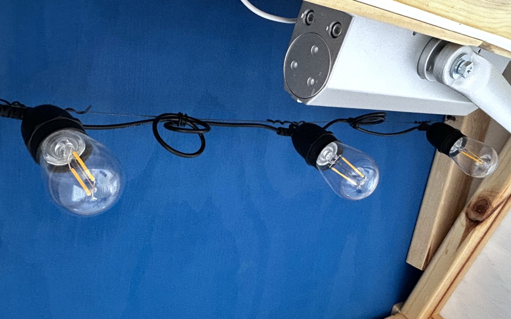

[MKFG](../../) / [Distribute](../)

# Self-Serve Kiosk

 

For ventures where theft is unlikely/tolerable (like bread, coffee, or produce), a self-serve storefront is a great way to allow customers to buy what you're selling without requiring you to be present. It's also a great way to build trust within a community.

Making your own self-serve kiosk is a fun project, but it can also be quite a bit of work. Your best bet is to **find an appropriate sized box, cabinet, or greenhouse that you can repurpose** as your mini storefront.

Keep in mind that your kiosk will likely be living outdoors in the full spectrum of weather, so take your time as you go to make sure it feels **sturdy and well sealed** against rain, snow, wind, and sun. You'll also want to **include vents** to allow for air circulation.

And **don't forget safety!** You must take care to **ensure that your kiosk cannot tip over**, either by accident or by playful kids monkeying around (like trying to lean on the door when it's open). You may want to consider some combination of **sturdy ground anchors and/or deeply planted posts** in the ground to make it secure.

## Build Instructions

Yes, you can make the exact kiosk shown here using the [Kiosk CAD files](./CAD). But in many ways, that's really not the point!

  

Building everything ourselves (including the door and windows) was also much more time consuming than necessary. Some element or two will be useful as you plan out your own build, but **don't feel the need to trace our footsteps if you have other ideas!**

Instead, we hope that this can primarily be *inspiration* as an end-to-end example of how a custom kiosk may be thoughtfully created. 

  

A few specific call-outs that may be of interest:

* **3D Printable vents**: A 2.125" hole saw is common for things like putting in door knobs or deadbolt locks. You can use that saw hole saw to cut holes in your kiosk anywhere you want vents, and then just place/caulk them in. These keep both rain and insects out, while still offering significant air flow. On our kiosk, we installed 6 vents total (3 near the bottom and 3 near the top).

* **3D Printable corner jigs**: If you're using your own 2x4 construction and want to make sure all of the hole line up, consider using a printed jig to hold boards squarely in place as you go.

* Ground anchors: You kiosk should be quite sturdy on its own, but it's still important to ensure there's no way it can tip over and injure someone. Ground anchors are a simple way to add multiple points of increased stability.

* **Paint / design**: Making your kiosk stand out at a distance is a simple way to get people talking and taking notice. Just be sure it's also tasteful and non-offensive to your neighbors. For Le Phare (the flagship bakery of [PALM bread](https://palmbread.com)), we chose a bright blue nautical theme and an iconic lighthouse to match.

* **Door closer**: We wanted the experience of using our kiosk to feel like a little shop, so we used a commercial grade door closer. It offers a pleasing amount of resistance when opening the door, and shuts the door slowly and firmly when a customer leaves.

* **Experience add-ons**: Beyond the kiosk structure itself, people want to be delighted when they go out of their way to visit. For Le Phare, when the kiosk is open for business there's an open sigh, warm LED bulb lights, an endless audio track of ocean waves (recorded off the northwest coast of France), and a charming chime that dings when you open the door.    

   

---

### :open_book: Open Source & Creative Commons

**Makeufacturing is fully open source**. It's released under 2 licenses for complete coverage:

* **All source code** (Arduino projects, C code, web code, etc.) is released under **[GNU GPL v3](https://www.gnu.org/licenses/gpl-3.0.en.html)**.

* **Everything else** (documentation, images, videos, write-ups, CAD files, drawings, etc.) is released under **[CC BY-SA 4.0](https://creativecommons.org/licenses/by-sa/4.0/)**.

### :speech_balloon: Questions / Suggestions / Feedback

Have an idea or found a bug? Let us know by **[filing an issue](https://github.com/Makeufacturing/MKFG/issues)** or sharing your **[thoughts/questions](https://github.com/Makeufacturing/MKFG/discussions)** with the community!

### :hand: Safety Disclaimer

> Working with automated equipment, electronics, power tools, hazardous chemicals, and DIY manufacturing systems requires proper precautions. Always wear appropriate safety gear including eye protection, gloves, and respiratory equipment when needed. Consult qualified professionals before working with electrical systems, chemicals, or complex machinery. Keep bystanders clear of operating equipment. Never leave automated systems unattended during operation. Ensure proper ventilation when working with fumes, dust, or chemical vapors. This information is for educational purposes only and does not replace professional safety training or equipment manufacturer instructions. This site and its contributors will not be held liable. **Use at your own risk.**

### :heart: Your support keeps us going :heart:

The Makeufacturing initiative is made possible by **[Makefast](https://makefastworkshop.com)**, a small, family-run prototyping and product development workshop located in Delaware, Ohio. After many attempts at manufacturing our own desktop fabrication products, it became clear how exciting (and technically difficult!) it was to create high quality products at scale out of our home using only DIY/Maker-level tools. We decided to openly catalog and share these learnings in the hopes that other makers around the world may benefit and further grow this **new, highly accessible, industrial revolution**.

If you appreciate this approach and want to see it grow, please consider contributing below. Your financial support allows us to put more time and effort into makeufacturing so that **more people can make more awesome things in more parts of the world**!

**[Support Makeufacturing with a contribution of any amount](https://buy.stripe.com/5kQfZi9WNeac3ba6trcQU02)**

Thanks, and **keep making awesome things!**