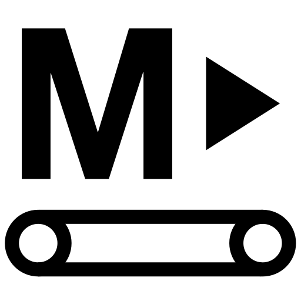

# Makeufacturing

 

**[Makeufacturing](https://mkfg.org)** (#mkfg) builds on the maker movement to form a **sustainable *maker economy***, putting the means of production into the hands of makers themselves to **create unique, inventive products** and **produce them at scale** with their own tools &mdash; all **fully inclusive and openly shared**.

## What is it?

Makeufacturing **leverages maker-level tools and materials** to enable **scaling up** tangible creative efforts. In contrast to large-scale manufacturing, *makeufacturing* allows creators to **retain full control** of the process, greatly **lower operating costs and investments**, and be able to **quickly adapt to local needs and preferences** that set their products apart.

For example, starting a small brick-and-mortar bakery in the United States can easily cost upwards of \$60,000 for equipment and infrastructure (commercial ovens, refrigerators, proofing chambers, cooling racks, counters, dishwashers, etc.), \$40,000/year for a lease, and require at least 1 additional full time employee to run the counter at a minimum of \$25,000/year. In total that's **\$125,000 for the first year** to get started, and **\$65,000/year after that** -- and that's in addition to your own full time efforts as a baker and the cost of ingredients, packaging, advertising, etc., as well as the **many months of planning and waiting** needed before even opening the doors.

In comparison, a **makeufacturing bakery costs about 100x less** (~\$1,250 to start, and ~\$650/yr to maintain), uses your existing home kitchen/oven, and in many cases can be initially up and running in **just a few days**. It also doesn't require a commute to/from a separate location, feeds local community members first, can be open on the days/hours most convenient to the baker, and allows for **lower overall prices while still producing more profit** due to the extremely low overhead of operating out of a home.

## How does it work?

Makeufacturing is built around these key **extensions of the maker approach**:

**[Amplify](./Amplify_ExtendingMakerTools/)**: Existing maker-level tools are an integral part of small-scale manufacturing; they just require some clever thinking to obtain more efficient operation and improve reliability (via print settings, batch processing, material selection, etc.).

**[Build](./Build_ConstructingNewMakerTools/)**: New DIY tools enable automating various parts of production that are tedious, time consuming, labor-intensive, or difficult to manually control (feeding raw materials, processing, bundling, verification, packaging, labeling, etc.).

**[Conduct](./Conduct_MKFGSystemExamples/)**: Putting together these new and existing maker tools enables scalable production. See these examples to get a sense for how all of the elements can be combined to support specific MKFG business ventures.

**[Distribute](./Distribute_HowWhenWhereToEarn/)**: Alternative models of distribution provide makers with a way to get their products into customers' hands without the overhead of consignment or leasing brick-and-mortar spaces. Not depending on large online and offline retailers benefits both the maker and the buyer (self-serve, on-site, bulk distribution, direct-to-consumer transactions, pay-what-you-wish pricing, etc.).

**[Elevate](./Elevate_WaysToImproveAndGrow/)**: Getting your first product out the door is just the beginning. Once you're up and running, it's important to consider new ways to improve and grow your makeufacturing venture over time to stay relevant and keep your business working as well as possible.

## Makeufacturing: The Next Industrial Revolution

The maker movement has demonstrated that individuals can create sophisticated products using accessible tools. Now, we're witnessing its evolution into a **maker economy** — a decentralized manufacturing ecosystem where creators become entrepreneurs, selling unique products directly to communities that value craftsmanship, customization, and local production.

This transformation represents more than just a business model shift. It's a fundamental reimagining of **how we produce, distribute, and consume goods**. By democratizing manufacturing through affordable technology — 3D printers under $300, laser cutters accessible through makerspaces, open-source electronics platforms, and abundant online learning resources — we're enabling a new class of micro-manufacturers.

Unlike traditional industrial models that require massive capital investment and create significant barriers to entry, the maker economy operates on principles of **accessibility, sustainability, and community**. Makers can start with a few hundred dollars in equipment, validate products locally, and scale production based on actual demand rather than speculative manufacturing.

This approach offers displaced workers new pathways to economic stability, provides creatives with direct monetization opportunities, and enables entrepreneurs to launch ventures without traditional corporate structures, massive pay gaps, or prohibitive investment overhead. The result is a **more resilient, distributed, and human-centered economy**.

While the current tech landscape **fixates on artificial intelligence (AI) and digital services** — technologies that often feel disconnected from tangible human experiences and physical reality — the maker economy represents **a return to making things that matter**. Unlike AI solutions that exist purely in the digital realm, maker products are touched, used, and experienced in the real world. They solve immediate physical problems, create lasting objects of beauty, and forge genuine connections between creators and communities.

The **makeufacturing movement** offers an antidote to our increasingly virtual existence, proving that the future isn't just about what machines can compute, but what **humans can create with their hands, minds, and accessible tools**.

---

### :open_book: Open Source & Creative Commons

**Makeufacturing is fully open source**. It's released under 2 licenses for complete coverage:

* **All source code** (Arduino projects, C code, web code, etc.) is released under **[GNU GPL v3](https://www.gnu.org/licenses/gpl-3.0.en.html)**.

* **Everything else** (documentation, images, videos, write-ups, CAD files, drawings, etc.) is released under **[CC BY-SA 4.0](https://creativecommons.org/licenses/by-sa/4.0/)**.

### :speech_balloon: Questions / Suggestions / Feedback

Have an idea or found a bug? Let us know by **[filing an issue](https://github.com/Makeufacturing/MKFG/issues)** or sharing your **[thoughts/questions](https://github.com/Makeufacturing/MKFG/discussions)** with the community!

### :heart: Your support keeps us going :heart:

The Makeufacturing initiative is made possible by **[Makefast](https://makefastworkshop.com)**, a small, family-run prototyping and product development workshop located in Delaware, Ohio. After many attempts at manufacturing our own desktop fabrication products, it became clear how exciting (and technically difficult!) it was to create high quality products at scale out of our home using only DIY/Maker-level tools. We decided to openly catalog and share these learnings in the hopes that other makers around the world may benefit and further grow this **new, highly accessible, industrial revolution**.

If you appreciate this approach and want to see it grow, please consider contributing below. Your financial support allows us to put more time and effort into makeufacturing so that **more people can make more awesome things in more parts of the world**!

**[Support Makeufacturing with a contribution of any amount](https://buy.stripe.com/5kQfZi9WNeac3ba6trcQU02)**

Thanks, and **keep making awesome things!**