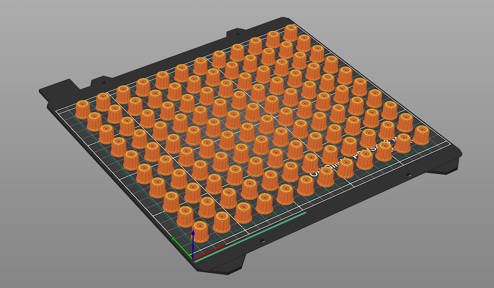
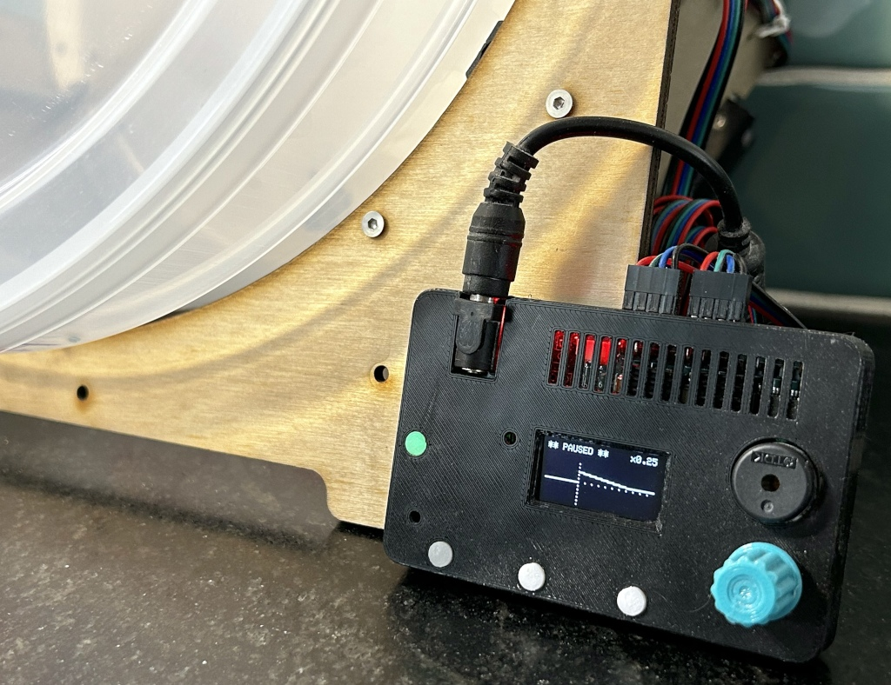
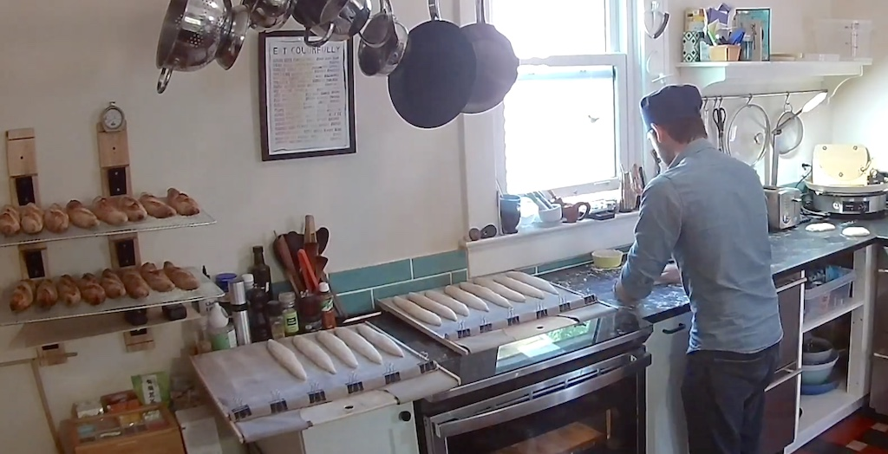
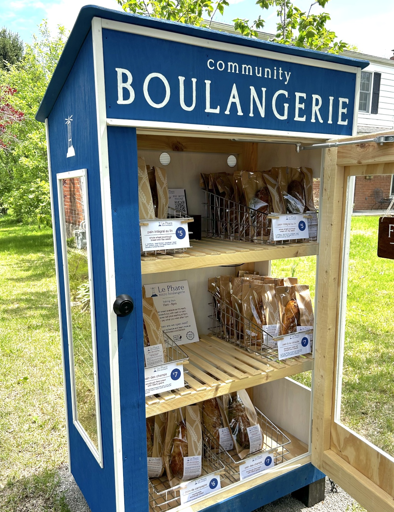
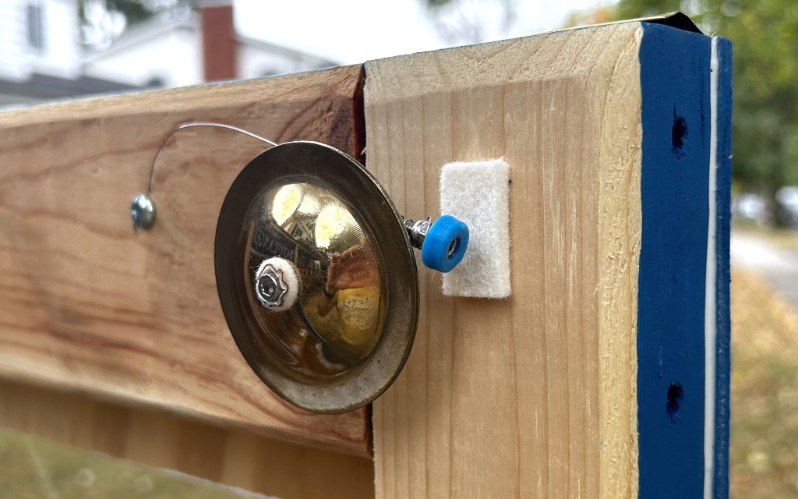

# Makeufacturing

 

**[Makeufacturing](https://mkfg.org)** (#mkfg) builds on the maker movement to form a sustainable ***maker economy***, putting the means of production into the hands of makers themselves to **create unique, inventive products** and **produce them at scale** with their own **accessible and open source** methods.

[TOC]

## What is it?

     

Makeufacturing **leverages maker-level tools and materials** to enable **scaling up** tangible creative efforts. In contrast to large-scale manufacturing, *makeufacturing* allows creators to **retain full control** of the process, greatly **lower operating costs and investments**, and be able to **quickly adapt to local needs and preferences** that set their products apart.

For example, starting a small brick-and-mortar bakery in the United States can easily cost upwards of \$60,000 for equipment and infrastructure (commercial ovens, refrigerators, proofing chambers, cooling racks, counters, dishwashers, etc.), \$40,000/year for a lease, and require at least 1 additional full time employee to run the counter at a minimum of \$25,000/year. In total that's **\$125,000 for the first year** to get started, and **\$65,000/year after that** -- and that's in addition to your own full-time efforts as a baker and the cost of ingredients, packaging, advertising, etc., as well as the **many months of planning and waiting** needed before even opening the doors.

In comparison, a **makeufacturing bakery costs about 100x less** (~\$1,250 to start, and ~\$650/yr to maintain), uses your existing home kitchen/oven, and in many cases can be initially up and running in **just a few days**. It also doesn't require a commute to/from a separate location, feeds local community members first, can be open on the days/hours most convenient to the baker, and allows for **lower overall prices while still producing more profit** due to the extremely low overhead of operating out of a home.

**Makeufacturers can start by automating only the most time-consuming or mundane tasks** and don't need to take on the whole production process at once. For example, an electronic project may require dozens of little wires to be cut to specific lengths and puting together a basic system that does all the wire cutting could drastically increase output, consistency, and overall enjoyment for the maker. As the need for additional automation grows, so can the scale and complexity of each product's makeufacturing system.

Beyond being a less expensive alternative for many aspects of production, **makeufacturing gives makers the ability to tinker and experiment with the production process itself**. Every product at the end of the line doesn't have to look and function the same. Each *makeufactory* has the potential to become an intrinsic part of the value of its products; each is a local, unique, open, and inspiring process.

## How does it work?

Makeufacturing is built around these key **extensions of the maker approach**:

**[Amplify](./Amplify_CommonMakerTools/)**: Existing maker-level tools are an integral part of small-scale manufacturing; they just require some clever thinking to obtain more efficient operation and improve reliability (via print settings, batch processing, material selection, etc.).

**[Build](./Build_NewToolsForMKFG/)**: New DIY tools enable automating various parts of production that are tedious, time consuming, labor-intensive, or difficult to manually control (feeding raw materials, processing, staging, dosing, bundling, verifying, packaging, labeling, etc.).

**[Conduct](./Conduct_ExamplesOfMKFGSystems/)**: Putting together these new and existing maker tools enables scalable production. See these examples to get a sense for how all of the elements can be combined to support specific MKFG business ventures.

**[Distribute](./Distribute_HowWhenWhereToEarn/)**: Alternative models of distribution provide makers with a way to get their products into customers' hands without the overhead of consignment or leasing brick-and-mortar spaces. Not depending on large online and offline retailers benefits both makers and customers (via self-serve, on-site, bulk distribution, direct-to-consumer transactions, pay-what-you-wish pricing, etc.).

**[Elevate](./Elevate_WaysToImproveAndGrow/)**: Getting your first product out the door is just the beginning. Once you're up and running, it's important to consider new ways to improve and grow your makeufacturing venture over time to stay relevant and keep your business working as well as possible.

## The Next Industrial Revolution

The maker movement has demonstrated that individuals can create sophisticated products using accessible tools. Now, we're witnessing its evolution into a **maker economy** — a decentralized manufacturing ecosystem where creators become entrepreneurs, selling unique products directly to communities that value craftsmanship, customization, and local production.

This transformation represents more than just a business model shift. It's a fundamental reimagining of **how we produce, distribute, and consume goods**. By democratizing manufacturing through affordable technology — 3D printers under $300, laser cutters accessible through makerspaces, open-source electronics platforms, and abundant online learning resources — we're enabling a new class of micro-manufacturers.

Unlike traditional industrial models that require massive capital investment and create significant barriers to entry, the maker economy operates on principles of **accessibility, sustainability, and community**. Makers can start with a few hundred dollars in equipment, validate products locally, and scale production based on actual demand rather than speculative manufacturing.

This approach offers displaced workers new pathways to economic stability, provides creatives with direct monetization opportunities, and enables entrepreneurs to launch ventures without traditional corporate structures, massive pay gaps, or prohibitive investment overhead. The result is a **more resilient, distributed, and human-centered economy**.

While the current tech landscape **fixates on artificial intelligence (AI) and digital services** — technologies that often feel disconnected from tangible human experiences and physical reality — the maker economy represents **a return to making things that matter**. Unlike AI solutions that exist purely in the digital realm, maker products are touched, used, and experienced in the real world. They solve immediate physical problems, create lasting objects of beauty, and forge genuine connections between creators and communities.

The **makeufacturing movement** offers an antidote to our increasingly virtual existence, proving that the future isn't just about what machines can compute, but what **humans can create with their hands, minds, and accessible tools**.

## **Makeufacturing Principles**

Just as specifications drive the technical side of development, **principles shape the approach and direction of an initiative**. 

Makeufacturing is guided by the following principles:

1. **Be safe. Do no harm.**
2. **Be open to reconfiguration.**
3. **Use standardized components.**
4. **Build specialized parts with maker-style tools.**
5. **Educate/empower/share/excite.**

### 1. Be safe. Do no harm. 

:warning: **Safety is a very serious matter for any automated system.**

While maker-style tools (including things like circular saws, soldering irons, desktop mills, and high voltage electronics) can be dangerous by themselves, including them in an automated system that may control and power them on/off at any time can be significantly *more dangerous*. For this reason, take safety extremely seriously and **always turn off and unplug the entire system before working on it or getting in harm's way** and **never leave a makeufacturing system plugged in or operational while unattended.** You should also **make a habit of wearing safety glasses, hearing protection, gloves**, and any other protective wear as appropriate to reduce the likelihood of injury to anyone around the system.

**Makeufacturing recommends 5 levels of safety redundancy** to minimize the chances that an accident occurs.

**Safety Redundancy Levels**

- **LEVEL 1**: Make the space itself safe. Have a fire extenguisher and smoke alarm in the space and clear any clutter. Use warnings, notices, labels, and physical barriers as appropriate to indicate where potential hazzards may exist (pinch points, sharp cutters, high voltage, loud noises, lasers, harmful dust, etc.).
- **LEVEL 2**: Use a single physical detachment point for all power (i.e. a single AC plug which could be pulled as a last resort to immediately turn everything off).
- **LEVEL 3**: Use a single physical switch for cutting power to the entire system (i.e. E-Stop switch inline with the main AC line, such as [this](https://www.amazon.com/Rockler-Woodworking-and-Hardware-TASB-72P/dp/B001DT13B2) or [this](https://www.amazon.com/POWERTEC-71008-Single-Phase-Switch/dp/B00KPEFL2I/) or [this](https://www.amazon.com/uxcell-Mushroom-Emergency-Button-Switch/dp/B0094GM004)).
- **LEVEL 4**: Require a hard-wired electrical signal to run/enable the system's control software (i.e. the system always waits for a hard-wired signal to start; it should be designed to never start on its own and never start remotely via wifi/bluetooth/IR/etc.).
- **LEVEL 5**: For complex systems with multiple controllers/segments, ensure that programmatically sensed unsafe conditions from any controller halt the entire system (i.e. temperature out of range, laser curtain interrupted, system fault, communication loss/timeout, etc.).

While much effort should be spent to properly address all safety levels, at a minimum **a dedicated safe space with a power strip (a single plug+switch) could be used to act as the first three levels and immediately shut down the system in case of emergency**. The higher levels are dependent on how controller boards and software are configured and must be carefully designed and implemented to maximize safety.

And beyond safety alone, make a point to **do no harm**. It's not enough to just add some switches or buttons to press in case something is out of place or otherwise unsafe. Safety is also a way of approaching how you build things, write code, design interactions, and organize your space (see [Asimov's Three Laws of Robotics](https://en.wikipedia.org/wiki/Three_Laws_of_Robotics)).

The most obvious form of harm would be for the system to turn something on unexpectedly which might cause injury. But in some complex situations, harm can actually come from not turning something on or even turning something off (think of a robotic arm holding a heavy weight and then dropping it when power is turned off). Physical barriers should also be used to keep people and animals from being able to get in a position where they could be injured by any system output (for example, a power surge/dip or programatic bug could cause behaviors beyond what was intended).

There are no hard and fast rules to guarantee safety, but rather a way of thinking. Be mindful of the consequences of getting things wrong and think/act defensively to constantly check and double check that nothing seems out of place.

### 2. Be open to reconfiguration.

Unlike large-scale, high volume factory production settings, makeufacturing intends to encourage smaller production runs and frequent reconfiguration/customization as ideas evolve.

While [lights out automation](https://en.wikipedia.org/wiki/Lights_out_%28manufacturing%29) may be the end goal for many users, automated manufacturing begins with stand-alone segments that perform dedicated tasks, and then may eventually be joined to perform multiple operations over a number of segments as a larger system.

Segments should be designed with flexibility in mind so that they can be rearranged and reconfigured over time as the production process evolves.

Automated systems evolve over time and rarely function using only a single segment. One segment may receive things from a previous segment, do some operation, and then pass them downstream to the next segment for further operations.

While anything can be used within a section of an automated system, the interface between segments should be strongly considered and prioritized in the design process to ensure simple reconfiguration.

### 3. Use standardized components.

Making thousands of something can wear out tools and components that normally seem to last forever. For example, a standard push button might be rated for a lifetime of 10,000 presses and that could be easily exceeded in a system that's cranking out hundreds of parts each day.

By using standardized and replaceable components whenever possible, the overhead of making repairs, upgrades, or alterations later on is greatly reduced.

### 4. Build specialized parts with maker-style tools.

Specialized parts to connect various components and perform specific tasks will often be created by makeufacturers themselves. Leveraging common maker-style tools whenever possible allows users to develop and share new ideas as quickly as possible.

Common maker-style tools include:

- Low-cost additive fabrication such as a 3D Printer.
- Basic electronics fabrication tools such as a soldering iron, multimeter, oscilloscope, etc.
- Common hand/power tools to cut, drill, shape, measure, clamp, fasten, etc.
- Common benchtop tools such as a drill press, disc sander, bandsaw, etc.
- A Computer to design, program, monitor, debug, print, etc.

3D printers are perhaps the most pervasive and useful maker-style tool available. While still somewhat expensive compared to basic hand and power tools, they are the hallmark of a machine that takes the dependency on other manufactures out of the equation and encourages makers to truly design, develop, and do it themselves.

As such, it seems fitting that makeufacturing should not be hesitant to suggest that a 3D printer is part of the primary toolset needed to fully engage in the process. As a fallback for those that are unable to use a 3D printer, specific printed parts could be sold in kits or even produced remotely via numerous printing services (such as shapeways, printathing, treatstock, ninjaprototype, etc.).

Encouraging the use of 3D printing in the makeufacturing initiative positions it to be part of the larger maker movement and integrated with other 3D design-file communities (such as Thingiverse, 3DHubs, etc.) which can be leveraged for additional inspiration, reference, and visibility (featured content, competitions, etc.).

**A note about CNC machines and lasercutters**: CNC mills/routers and lasercutters are also common in makerspaces (and can be relatively inexpensive for some applications), but should only be used when necessary because they drastically increase the cost and complexity for many users outside of large cities/institutions who already have those machines up and running.

### 5. Educate / empower / share / excite.

Makeufacturing should be considered an extension of the maker movement, raising the ceiling for what makers can do beyond building things one at a time. Education and empowerment are at the heart of makeufacturing and hope to serve as inspiration for the next wave of manufacturing where local, original, creative ideas can hold their own alongside traditional mass produced items.

Beyond the positive effects of educating and encouraging more creative output to society at large, exciting others about the potential of makeufacturing also serves to further accelerate its rate of growth and expand makeufacturing's overall capabilities. Openly sharing and discussing ideas, code, circuitry, and system designs is encouraged whenever possible.

## Terminology

Using specific terms makes it easier to categorize (and subsequently find/discuss) parts of a system. To clarify, here's a short list of **Makeufacturing terms.**

- **Subject**: the item(s) moving through a system onto which automation is being performed (e.x. wood blocks to paint, jelly beans to count, flour to weigh, eggs to crack, boxes to label, etc.). 
- **Component**: an individual part, sensor, controller, or actuator used to create a larger device to do useful work (see: *segment*). Components are the fundamental building block of automated systems and should be designed for easy replacement in the event of failure.
  - **Controller**: a dedicated piece of hardware with inputs, outputs, and processing power to direct actions toward a desired goal.
  - **Sensor**: any *input* that informs the controller about the world (buttons, switches, capacitive touch/presence, light, temperature, magnetic field, rotation, position, audio, weight, vibration, etc.).
  - **Actuator**: any *output* that the controller can use to act on the world (LEDs, speakers, DC motors, stepper motors, servos, solenoids, heaters, lasers, pumps, fans, vibrators, valves, etc.).
  - **Structure**: any standardized mechanical building block that supports or shapes the system.
  - **Fastener**: any mechanical element that joins or otherwise holds other components together.
  - **Part**: any custom mechanical element that supports or joins other components together (often 3D printed, tagged #mkfg for global searchability).
  - **Module**: a minimal set of components that function together and can be viewed as a component itself (for example, a break-beam sensor has a laser/LED output, a light sensor, and a bit of structure/fasteners to position them, but it can be thought of as single component that detects when an object is between the light source and the sensor).
- **Segment**: a stand-alone part of a system comprised of one or more components that performs a dedicated, automated task.
  - **Operator**: a segment whose primary function is to <u>physically change the subject</u> (cut, drill, paint, stamp, shape, fasten, heat, glue, wash, solder, print, label, etc.).
  - **Handler**: a segment whose primary function is to <u>move, orient, or control the flow of subjects</u> (conveyor belts, bulk feeders, pick-and-place machines, part aligners, baggers, organizers, selectors,  dosers, etc.).
  - **Inspector**: a segment whose primary function is to <u>passively sense and analyze subjects</u> as they move through the system without taking direct action; often for quality control, verification, and statistical analysis (visual inspection, counters, scales, color/temperature detectors, etc.).
- **System**: a set of one or more segments working together to perform multiple automated tasks; often a series of operators and handlers that alternate between working on a subject and transferring it to the next segment.

## :open_book: Open Source & Creative Commons

**Makeufacturing is fully open source**. It's released under 2 licenses for complete coverage:

* **All source code** (Arduino projects, C code, web code, etc.) is released under **[GNU GPL v3](https://www.gnu.org/licenses/gpl-3.0.en.html)**.

* **Everything else** (documentation, images, videos, write-ups, CAD files, drawings, etc.) is released under **[CC BY-SA 4.0](https://creativecommons.org/licenses/by-sa/4.0/)**.

## :speech_balloon: Questions / Suggestions / Feedback

Have an idea or found a bug? Let us know by **[filing an issue](https://github.com/Makeufacturing/MKFG/issues)** or sharing your **[thoughts/questions](https://github.com/Makeufacturing/MKFG/discussions)** with the community!

## :hand: Safety Disclaimer

> Working with automated equipment, electronics, power tools, hazardous chemicals, and DIY manufacturing systems requires proper precautions. Always wear appropriate safety gear including eye protection, gloves, and respiratory equipment when needed. Consult qualified professionals before working with electrical systems, chemicals, or complex machinery. Keep bystanders clear of operating equipment. Never leave automated systems unattended during operation. Ensure proper ventilation when working with fumes, dust, or chemical vapors. This information is for educational purposes only and does not replace professional safety training or equipment manufacturer instructions. This site and its contributors will not be held liable. **Use at your own risk.**

## :heart: Your support keeps us going :heart:

The Makeufacturing initiative is made possible by **[Makefast](https://makefastworkshop.com)**, a small, family-run prototyping and product development workshop located in Delaware, Ohio. After many attempts at manufacturing our own desktop fabrication products, it became clear how exciting (and technically difficult!) it was to create high quality products at scale out of our home using only DIY/Maker-level tools. We decided to openly catalog and share these learnings in the hopes that other makers around the world may benefit and further grow this **new, highly accessible, industrial revolution**.

If you appreciate this approach and want to see it grow, please consider contributing below. Your financial support allows us to put more time and effort into makeufacturing so that **more people can make more awesome things in more parts of the world**!

**[Support Makeufacturing with a contribution of any amount](https://buy.stripe.com/5kQfZi9WNeac3ba6trcQU02)**

Thanks, and **keep making awesome things!**